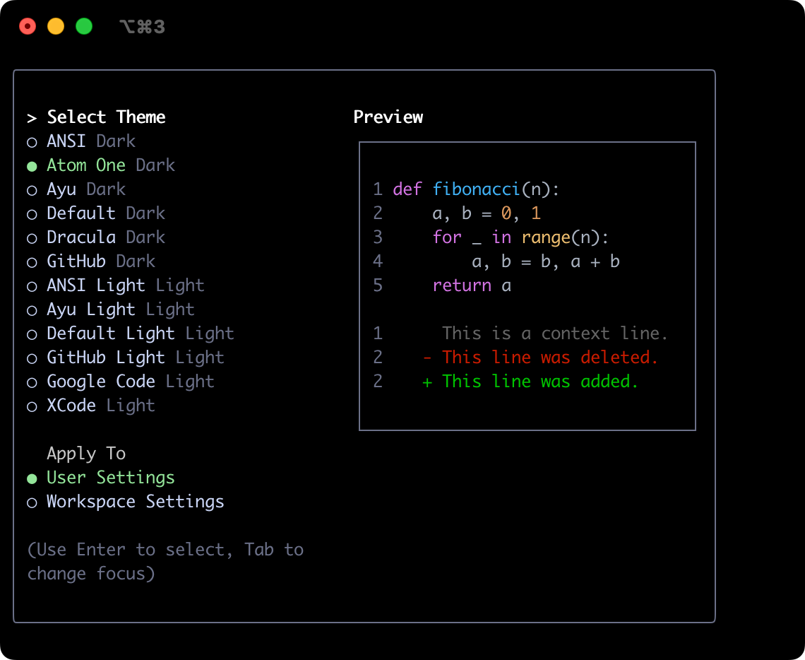
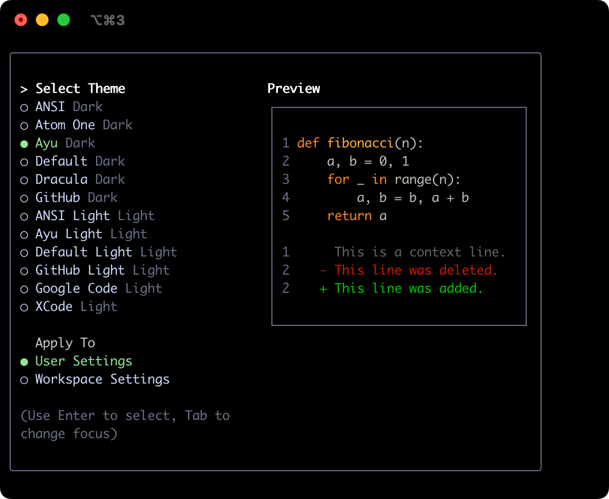
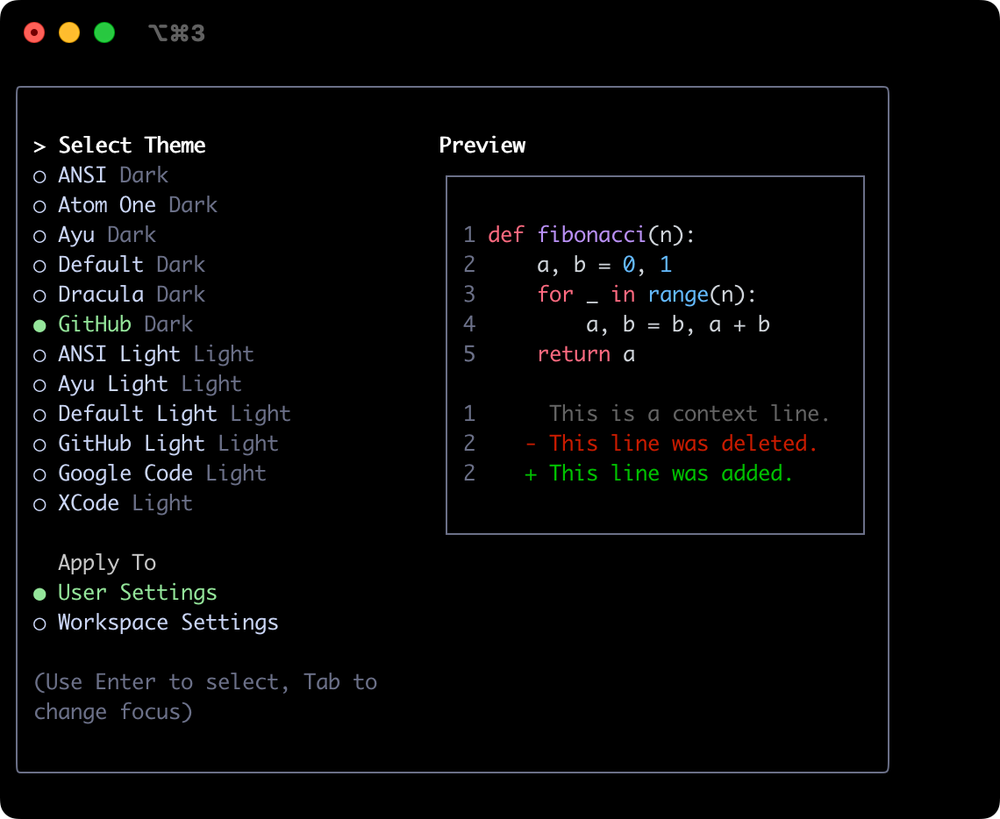
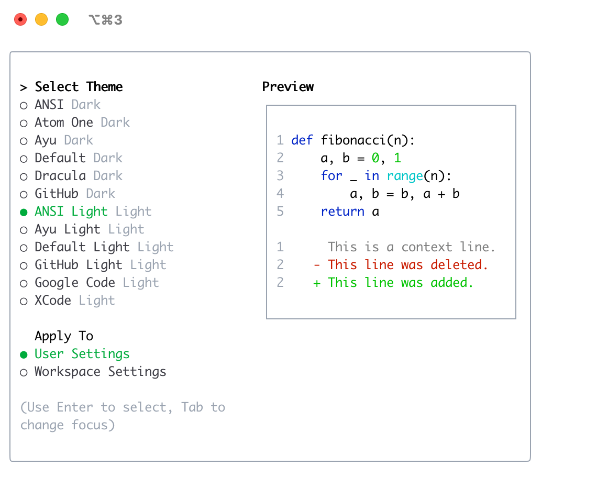
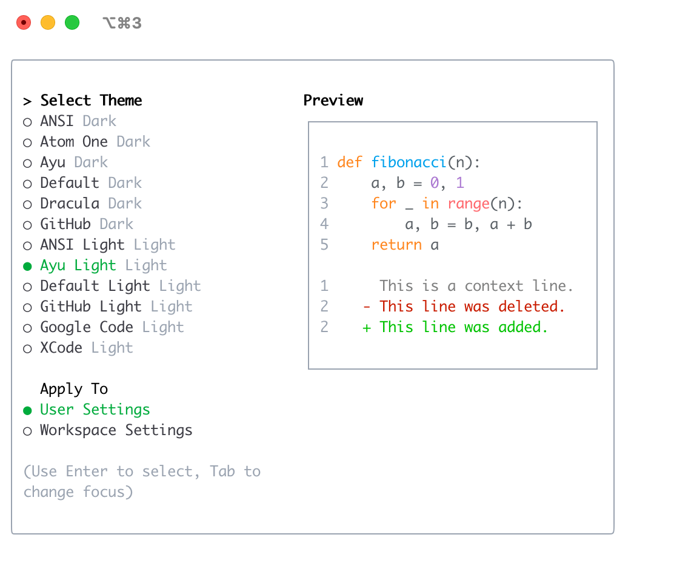
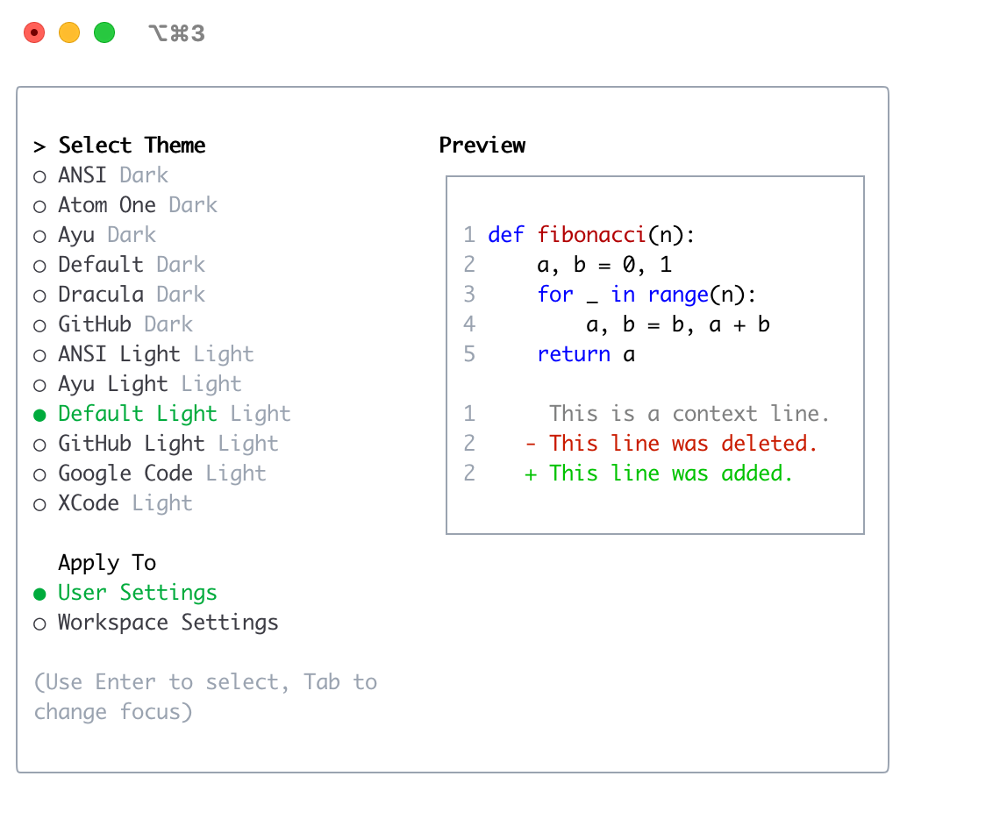

# 主题

Gemini CLI 支持多种主题来自定义其配色方案和外观。您可以通过 `/theme` 命令或 `"theme":` 配置设置来更改主题以适合您的偏好。

## 可用主题

Gemini CLI 附带一系列预定义主题，您可以在 Gemini CLI 中使用 `/theme` 命令列出这些主题：

- **深色主题：**
  - `ANSI`
  - `Atom One`
  - `Ayu`
  - `Default`
  - `Dracula`
  - `GitHub`
- **浅色主题：**
  - `ANSI Light`
  - `Ayu Light`
  - `Default Light`
  - `GitHub Light`
  - `Google Code`
  - `Xcode`

### 更改主题

1.  在 Gemini CLI 中输入 `/theme`。
2.  将出现一个对话框或选择提示，列出可用的主题。
3.  使用箭头键选择一个主题。某些界面可能会在您选择时提供实时预览或突出显示。
4.  确认您的选择以应用主题。

### 主题持久性

所选主题保存在 Gemini CLI 的[配置](./configuration.md)中，因此您的偏好会在会话之间被记住。

## 深色主题

### ANSI

### Atom OneDark

### Ayu

### 默认

### Dracula

### GitHub

## 浅色主题

### ANSI Light

### Ayu Light

### Default Light

### GitHub Light

### Google Code

### Xcode

